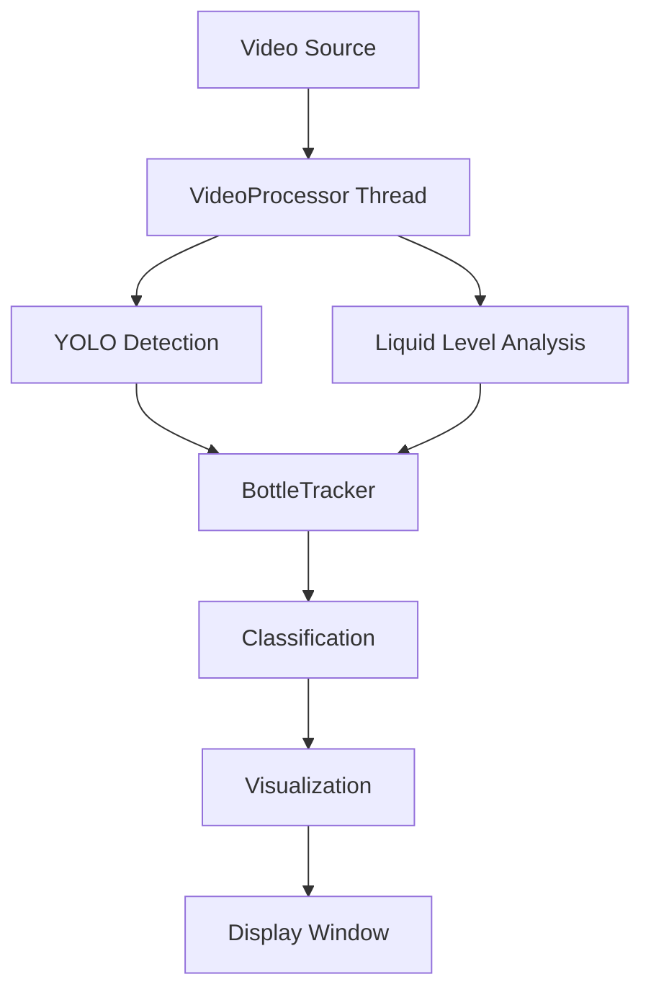

# GitHub Repository Structure

This document shows the recommended organization for publishing the Bottle Liquid Inspection System on GitHub.

## Recommended Repository Layout

```
bottle-liquid-inspection/
│
├── 📄 README.md                          # ⭐ Main documentation (408 lines)
├── 📄 LICENSE                            # MIT License
├── 📄 .gitignore                         # Git exclusion rules
├── 📄 requirements.txt                   # Python dependencies
├── 📄 config.example.json                # Configuration template
│
├── 🚀 bottle_liquid_inspector.py         # ⭐ MAIN APPLICATION (1,039 lines)
├── 🔧 quick_start.py                     # Diagnostic & launcher script
│
├── 📁 docs/                              # Documentation directory
│   ├── INSTALLATION.md                   # Platform-specific setup (432 lines)
│   ├── TRAINING_GUIDE.md                 # Custom YOLO training (437 lines)
│   ├── USER_MANUAL.md                    # User operations guide (586 lines)
│   └── API_REFERENCE.md                  # Developer documentation (future)
│
├── 📁 examples/                          # Example files (optional)
│   ├── configs/
│   │   ├── coke_500ml.json
│   │   ├── sprite_1l.json
│   │   └── water_1.5l.json
│   └── videos/
│       └── (sample test videos - optional)
│
├── 📁 assets/                            # Media for documentation (optional)
│   ├── screenshots/
│   │   ├── main_window.png
│   │   ├── calibration_view.png
│   │   └── results_export.png
│   ├── diagrams/
│   │   ├── architecture.svg
│   │   └── workflow.svg
│   └── demos/
│       └── demo_animation.gif
│
├── 📁 tests/                             # Unit tests (future enhancement)
│   ├── test_detector.py
│   ├── test_tracker.py
│   └── test_config.py
│
└── 📁 scripts/                           # Utility scripts (optional)
    ├── convert_annotations.py
    └── batch_process_videos.py
```

## Core Files (Ready Now) ✅

These files are complete and ready for GitHub publication:

### Essential Files
- ✅ `README.md` - Professional project documentation
- ✅ `LICENSE` - MIT open-source license
- ✅ `.gitignore` - Proper exclusions for Python/ML projects
- ✅ `requirements.txt` - All dependencies listed
- ✅ `config.example.json` - Template configuration

### Application Code
- ✅ `bottle_liquid_inspector.py` - Complete PyQt5 application (1,039 lines)
- ✅ `quick_start.py` - System checker and launcher (153 lines)

### Documentation
- ✅ `docs/INSTALLATION.md` - Windows, Linux, macOS, Docker, GPU setup
- ✅ `docs/TRAINING_GUIDE.md` - Full YOLOv8 training walkthrough
- ✅ `docs/USER_MANUAL.md` - Comprehensive user operations guide
- ✅ `PROJECT_SUMMARY.md` - Development summary (for your reference)

## Optional Enhancements (Future)

### 1. Add Screenshots
Create `assets/screenshots/` directory with:
- Main window screenshot
- Calibration close-up
- Results export example
- Statistics dashboard

**How to capture:**
```bash
# Run application, then use screenshot tool
# Windows: Win+Shift+S
# Linux: gnome-screenshot or flameshot
# Mac: Cmd+Shift+4
```

### 2. Architecture Diagram
Create `assets/diagrams/architecture.svg`:


### 3. Demo Animation
Create `assets/demos/demo.gif` showing:
- Loading video
- Calibrating virtual line
- Running inspection
- Exporting results

**Tools**: 
- ScreenToGif (Windows)
- Peek (Linux)
- LICEcap (Cross-platform)

### 4. Example Configurations
Create `examples/configs/` with product-specific presets:
```json
// coke_500ml.json
{
  "target_line_y": 730,
  "tolerance": 5,
  "conf_threshold": 0.3,
  ...
}
```

### 5. Test Suite
Add `tests/` directory with unit tests:
```python
# test_detector.py
def test_liquid_level_detection():
    # Test with synthetic images
    pass

def test_bottle_classification():
    # Test pass/reject logic
    pass
```

## GitHub Publication Checklist

### Pre-Publication
- [ ] Review all code for hardcoded paths
- [ ] Remove sensitive information from configs
- [ ] Test installation on clean system
- [ ] Verify all documentation links work
- [ ] Add repository description and tags

### Repository Settings
- [ ] Choose descriptive name: `bottle-liquid-inspection`
- [ ] Add description: "Professional PyQt-based liquid level quality control using YOLOv8"
- [ ] Set visibility: Public (recommended for open-source)
- [ ] Add topics/tags: 
    - `computer-vision`
    - `yolo`
    - `quality-control`
    - `pyqt5`
    - `opencv`
    - `deep-learning`
    - `manufacturing`
    - `automation`

### Initial Commit
```bash
# Initialize repository
git init
git add .
git commit -m "Initial release: Complete bottle liquid inspection system

Features:
- PyQt5 GUI with real-time video processing
- YOLOv8 + ByteTrack detection and tracking
- Precision calibration with keyboard controls
- CSV data export and statistics
- Comprehensive documentation

Documentation:
- README.md with quick start guide
- INSTALLATION.md for platform-specific setup
- TRAINING_GUIDE.md for custom models
- USER_MANUAL.md for operations"
```

### Push to GitHub
```bash
# Add remote (create repo on GitHub first)
git remote add origin https://github.com/yourusername/bottle-liquid-inspection.git

# Push to main branch
git push -u origin main

# Or push to master if preferred
git branch -M master
git push -u origin master
```

### Post-Publication
- [ ] Share on relevant subreddits (r/computervision, r/MachineLearning)
- [ ] Post on LinkedIn and Twitter
- [ ] Submit to Ultralytics YOLO community showcase
- [ ] Consider arXiv paper for academic audience
- [ ] Add to personal portfolio/website

## Repository Badges to Add

After publication, add these badges to README:

```markdown
[](https://github.com/yourusername/bottle-liquid-inspection/stargazers)
[](https://github.com/yourusername/bottle-liquid-inspection/network/members)
[](https://github.com/yourusername/bottle-liquid-inspection/issues)
[](https://github.com/yourusername/bottle-liquid-inspection/blob/main/LICENSE)
```

## Version Tagging Strategy

Use semantic versioning for releases:

```bash
# Initial release
git tag -a v1.0.0 -m "Initial stable release"
git push origin v1.0.0

# Future updates
git tag -a v1.1.0 -m "Added multi-camera support"
git tag -a v1.0.1 -m "Bug fixes and performance improvements"
```

## GitHub Pages (Optional)

For enhanced documentation website:

1. Enable GitHub Pages in repository settings
2. Use MkDocs or Sphinx for documentation generation
3. Deploy automatically via GitHub Actions

Example `.github/workflows/docs.yml`:
```yaml
name: Deploy Documentation
on:
  push:
    branches: [main]
jobs:
  deploy:
    runs-on: ubuntu-latest
    steps:
      - uses: actions/checkout@v2
      - uses: actions/setup-python@v2
        with:
          python-version: '3.9'
      - run: pip install mkdocs-material
      - run: mkdocs gh-deploy --force
```

## Community Engagement

### Encourage Contributions
- Add `CONTRIBUTING.md` with contribution guidelines
- Create issue templates for bug reports and feature requests
- Set up GitHub Discussions for Q&A
- Label good first issues for new contributors

### Maintenance Plan
- Respond to issues within 48 hours
- Review pull requests weekly
- Release updates monthly
- Archive stale issues after 6 months

## Analytics & Impact

Track repository performance:
- Stars and forks over time
- Clone traffic from GitHub Insights
- Citation count (if used in research)
- Download statistics (if using PyPI)

## Summary

✅ **Current Status**: All core files complete and ready  
📦 **Files Created**: 10 essential files (code + docs)  
🎯 **Next Step**: Follow checklist above to publish  

**Estimated Time to Publish**: 30-60 minutes
- 10 min: Final review and cleanup
- 15 min: Create initial commit
- 15 min: Upload to GitHub and configure settings
- 20 min: Add screenshots and enhance README (optional)

---

**Your bottle liquid inspection system is production-ready and GitHub-worthy! 🚀**
