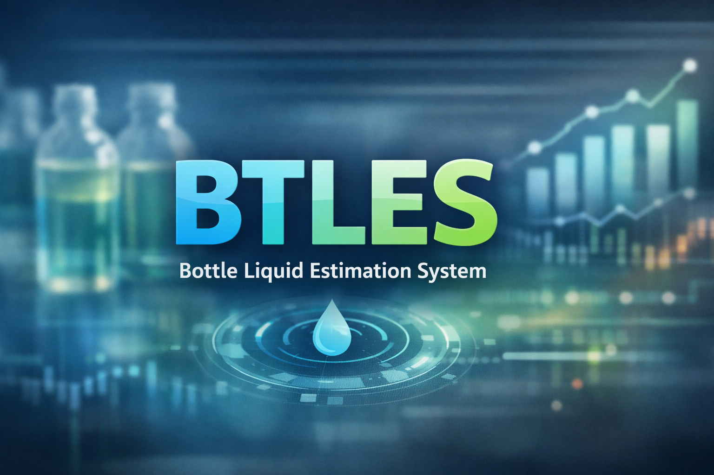

# BottleVision — Liquid Level Estimation System

> **Real-time bottle liquid level detection and quality inspection powered by YOLOv8 + ByteTrack.**

---

## What is it?

**BottleVision** is a production-ready computer vision system that automatically inspects
bottles on a conveyor (or in any video source) and determines whether the liquid fill level
meets your quality threshold — all in real time.

```

Video / Camera feed
       │
       ▼
  YOLOv8  ──►  Bottle detected  ──►  Crop ROI
       │
       ▼
  Gaussian Blur  ──►  Gradient Analysis  ──►  Liquid level Y
       │
       ▼
  Compare to Virtual Line  ──►  PASS ✅ / REJECT ❌
```

### Key features

| Feature | Detail |
|---------|--------|
| **Detection** | YOLOv8s fine-tuned on custom bottle dataset |
| **Tracking** | ByteTrack multi-object tracking (each bottle inspected once) |
| **Liquid sensing** | Gaussian blur + steepest gradient detection of liquid/air interface |
| **Calibration UI** | Move the virtual acceptance line with ↑ ↓ arrow keys (1 px steps) |
| **All-in-one app** | Single PyQt5 window — no separate calibration script needed |
| **Live preview** | Annotated feed shows bounding boxes, liquid level line, and stats overlay |
| **Event log** | Scrollable timestamped log of every pass/reject decision |

---

## Quick Start

### 1 — Install dependencies

```bash
pip install -r requirements.txt
```

> Python 3.9+ recommended.

### 2 — Run the application

```bash
python app.py
```

### 3 — Load a video or camera

1. Choose **Video File** or **Camera** from the source dropdown.
2. Click **Browse** (for video) or set the camera index.
3. Select your YOLO model (`.pt` file).  The default `best.pt` is pre-filled.
4. Click **▶ Start**.

---

## Built-in Calibration

The **Calibration** panel (left sidebar) lets you position the virtual acceptance line
_while the video is running_, with changes reflected in the preview and detection logic
**instantly**.

| Action | Result |
|--------|--------|
| **↑ / ↓ arrow keys** | Move line ±1 px (or ± step-size px) |
| **Shift + ↑ / ↓** | Move line ±10 × step-size |
| **Step size spinbox** | Set the movement granularity |
| **Jump to** field | Type a pixel value and click ↳ Set |
| **💾 Save Calibration** | Writes `calibration.txt` with the `TARGET_LINE_Y` value |

After calibration, paste the saved `TARGET_LINE_Y` value into any standalone script or
CI/CD pipeline config.

---

## How it Works — Deep Dive

### 1. YOLO Object Detection

A YOLOv8s model is fine-tuned on a bottle dataset.  During inference each frame is
passed through the model at 640 × 640.  Detections with confidence ≥ `CONF` are kept.

### 2. ByteTrack Multi-Object Tracking

ByteTrack assigns a persistent `track_id` to each bottle across frames.  Once a bottle's
bounding-box center crosses the **detection line** (vertical cyan line) it is processed
exactly once — preventing double-counting on fast conveyors.

### 3. ROI Crop & Liquid Level Detection

The YOLO bounding box is cropped from the frame.  Inside the crop:

1. Convert to grayscale.
2. Apply Gaussian blur (kernel size configurable, odd number).
3. Compute the vertical intensity profile (column-averaged).
4. Find the steepest intensity gradient — this is the liquid/air interface.
5. Fallback: if gradient < threshold, look for a consistently dark region.

The detected interface Y coordinate is converted back to the full-frame coordinate system.

### 4. Pass / Reject Decision

```
liquid_level_Y  ≤  TARGET_LINE_Y + tolerance  →  PASS  ✅
liquid_level_Y  >  TARGET_LINE_Y + tolerance  →  REJECT (low fill)  ❌
liquid_level_Y  not detected                  →  UNKNOWN  ⚠
```

The green horizontal line in the preview is `TARGET_LINE_Y`.  Red dashed lines
show the ± tolerance band.

---

## Training Your Own Model

### Dataset

1. Collect images of your bottles (filled and unfilled).
2. Label bounding boxes using [Label Studio](https://labelstud.io/) or
   [Roboflow](https://roboflow.com/) — export in **YOLO format**.
3. Recommended: ≥ 200 images covering lighting/angle/background variation.

### Fine-tune

```bash
yolo train \
  model=yolov8s.pt \
  data=dataset/data.yaml \
  epochs=60 \
  imgsz=640 \
  batch=16
```

The best checkpoint will be saved at `runs/detect/train/weights/best.pt`.
Copy it to your project folder and select it in the **Model** file picker.

### data.yaml example

```yaml
path: ./dataset
train: images/train
val:   images/val

names:
  0: bottle
```

---

## Configuration Reference

| Parameter | Default | Description |
|-----------|---------|-------------|
| `TARGET_LINE_Y` | 400 | Virtual acceptance line (px from top) |
| `TOLERANCE` | 5 | ± px band around target line |
| `CONF_THRESHOLD` | 0.30 | YOLO minimum detection confidence |
| `IOU_THRESHOLD` | 0.45 | ByteTrack IoU threshold |
| `GAUSSIAN_KERNEL_SIZE` | 5 | Blur kernel (must be odd) |
| `MIN_GRADIENT_THRESHOLD` | 10 | Minimum gradient to accept as liquid edge |
| `DETECTION_LINE_POSITION` | 0.50 | Fraction of frame width for the trigger line |

All parameters are adjustable live in the **Detection Settings** panel — no restart needed.

---

## Project Structure

```
bottle_liquid_estimation/
├── app.py                  ← Main PyQt5 application (this file runs everything)
├── best.pt                 ← Pre-trained YOLO model checkpoint
├── requirements.txt        ← Python dependencies
├── calibration.txt         ← Auto-generated after saving calibration
├── claude_final.py         ← Original headless detection script (reference)
└── calibrate_liquid_level.py ← Original CV2 calibration tool (reference)
```

---

## License

MIT — free to use, modify, and distribute.

---

*Built with [Ultralytics YOLOv8](https://github.com/ultralytics/ultralytics),
[OpenCV](https://opencv.org/), and [PyQt5](https://www.riverbankcomputing.com/software/pyqt/).*
